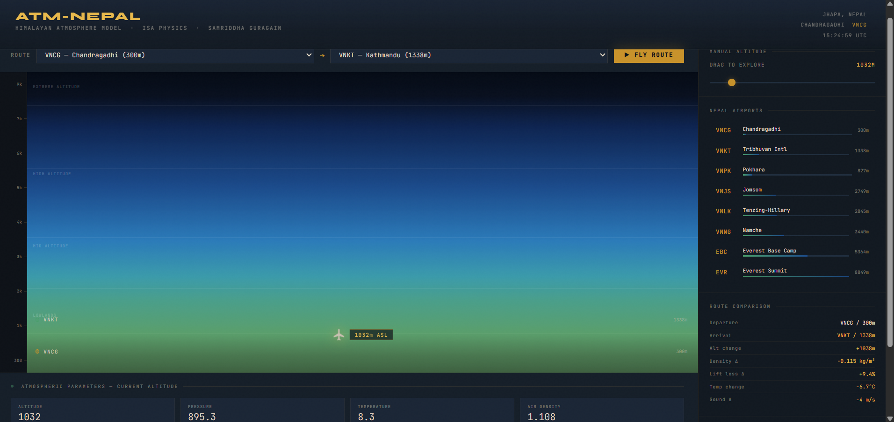

# 🏔️ ATM-Nepal — Himalayan Atmosphere Model

An interactive atmospheric physics simulator for Nepal's altitude range —
from Chandragadhi (300m) to Everest (8849m). Select a route, fly it, and
watch real ISA physics update in real time. Physics foundation for NepalSky.

**[Try it live →](https://samriddha-guragain.github.io/ATM-Nepal)**





---

## Why I Built This

I learned to ride a bike on the runway of Chandragadhi Airport in Jhapa.
That runway sits at 300 metres. Everest sits at 8849. The atmosphere
between those two points is not the same air.

Every aircraft that flies in Nepal is fighting physics that most simulators
ignore — thin air, dramatic altitude changes, terrain that leaves no room
for error. This tool makes those physics visible.

It's also the foundation layer for a larger project: a live Nepali airspace
intelligence dashboard that I'm building to eventually hand to CAAN.

---

## What It Simulates

- **Pressure** — ISA barometric equation, troposphere and stratosphere
- **Temperature** — standard lapse rate 6.5°C per 1000m
- **Air Density** — derived from pressure and temperature via ideal gas law
- **Lift Loss** — percentage drop in aerodynamic lift vs sea level
- **Engine Power Loss** — power degradation from reduced air density

All equations implemented from scratch. No physics libraries.

---

## Airports Included

| ICAO | Airport | Elevation |
|------|---------|-----------|
| VNCG | Chandragadhi, Jhapa | 300m |
| VNKT | Tribhuvan International, Kathmandu | 1338m |
| VNPK | Pokhara | 827m |
| VNJS | Jomsom | 2749m |
| VNLK | Tenzing-Hillary, Lukla | 2845m |
| VNNG | Namche | 3440m |
| EBC | Everest Base Camp | 5364m |
| EVR | Everest Summit | 8849m |

---

## How to Run

**Easiest — just open the HTML:**

```bash
git clone https://github.com/samriddha-guragain/ATM-Nepal
cd ATM-Nepal
open index.html
```

---

## How to Use
Select a route — pick departure and arrival airports, hit Fly Route
Watch the physics — all parameters update as the aircraft climbs or descends
Click the sky — tap any point on the atmosphere canvas to read
parameters at that altitude instantly
Manual slider — drag to any altitude between 0 and 8849m
Airport list — click any airport in the sidebar to jump there directly

---

## Physics

**Temperature**
**(Troposphere, 0–11,000m)**

T = T₀ − L·h
where T₀ = 288.15 K, L = 0.0065 K/m, h = altitude in metres

**Pressure**

P = P₀ · (T/T₀)^(g/L·R)
where P₀ = 101325 Pa, g = 9.80665 m/s², R = 287.05 J/kg·K

**Stratosphere approximation**
**(above 11,000m)**

P = P₁₁ · e^(−g·(h−11000) / R·T₁₁)

**Temperature held constant**
at T₁₁ = 216.65 K

**Air Density**

ρ = P / (R·T)

**Density Ratio**

σ = ρ / ρ₀
where ρ₀ = 1.225 kg/m³ (sea level)

**Lift Loss**

Lift Loss (%) = (1 − σ) × 100

**Engine Power Loss**

Engine Loss (%) = (1 − σ^0.7) × 100

**Speed of Sound**

a = √(γ·R·T)
where γ = 1.4 (ratio of specific heats for air)
All based on ICAO Doc 7488 — ISA Standard Atmosphere.

## Built With

Vanilla HTML / CSS / JavaScript
No external libraries
No backend
ISA Standard Atmosphere equations (ICAO Doc 7488)

---

## Part of a Larger Project

ATM-Nepal is the physics foundation for NepalSky — a live Nepali
airspace intelligence dashboard combining real-time flight tracking,
airspace stress mapping, emergency landing viability calculation, and
monsoon diversion prediction. Built for Nepal. Eventually for CAAN.

---

## Open Source

Use it, fork it, build on it. If you find a physics error, open an issue.
I want this to be accurate.

---

Built by _Samriddha Guragain_
